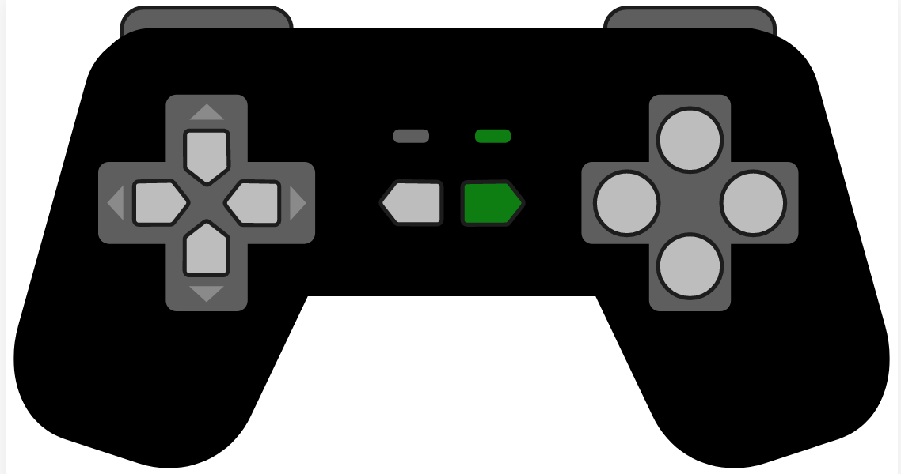

# joystick

* A React joystick component
* SVG output makes it scalable
* Support click event and tap event
* customerize key event and press interval




# How to use

## basic

see code in examples/index.js

```
const kp = (k) => {
  console.log(`key ${k} pressed`)
}

const kl = (k) => {
  console.log(`key ${k} release`)
}

ReactDOM.render(<Joystick onKeyPress={kp} onKeyRelease={kl}/>, document.getElementById('react'))
```

## advance

### keys

keys can be passed to customerize your key event. For example, following code will emit pass x to onKeyPress callback when the Up button clicked.

```
<Joystick keys={{
  Up: 'x',
}}/>
```

Here are all keys default settings 
```
{
  Up: 'w',
  Down: 's',
  Left: 'a',
  Down: 'd',
  A: 'A',
  B: 'B',
  C: 'C',
  D: 'D',
  Select: 'n',
  Start: 'm',
}
```

### interval
interval determines the time interval between two keyPress event when some key is holding. The default value is 200ms, which means if any key is holding, every 200ms will emit a keypress event.
```
<Joystick interval={250} />
```

# build

## development build
```
npm run build
```

## production build
```
npm run production
```

# Github
https://github.com/hoyt-tian/joystick

# Related Project
2D game engine https://github.com/hoyt-tian/FEngine

# About Me
https://www.hoyt-tian.com/

